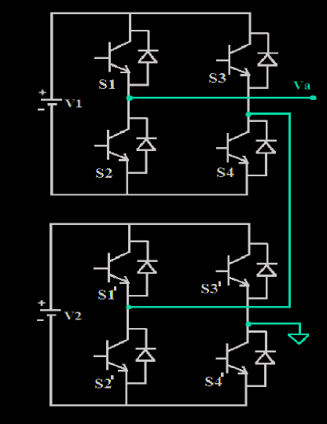
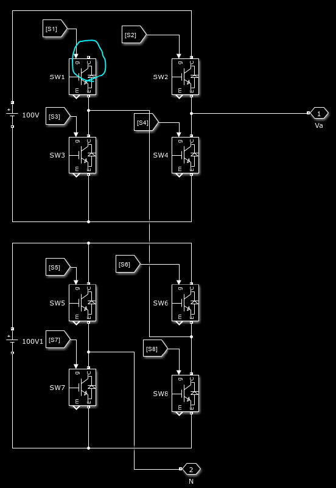
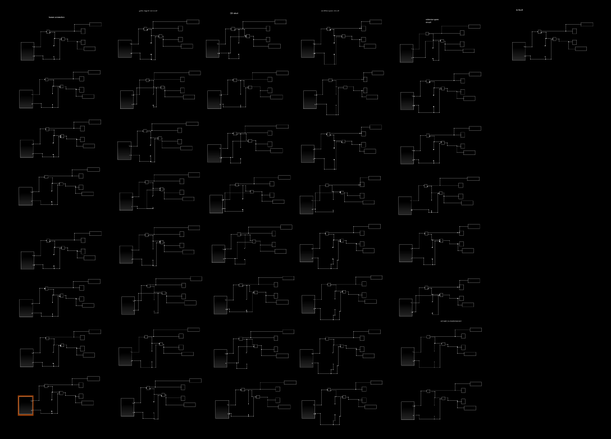

# inverter ai fault detection
5 level H bridge cascaded inverter fault detection using Machine Learning algorithms.

---
**Stages:**
- **[done]** collecting dataset from "5 level H bridge cascaded inverter" in a simulation environment.
- **[working]** applying different ML / DL algorithms on the dataset and trying to find the best one

---

#### Data Collection:
I used **Simulink** as the main simulation environment and implemented "5 level H bridge cascaded inverter" in that.

Then I applied different **different faults (collector open, emitter open, etc)** on some of the circuits in purpose, and then run the simulation and sampled the output voltages and currents and collected them.

 
 

- image of one of the circuits in the simulink:

 

- image of all of the circuits in the simulink:

